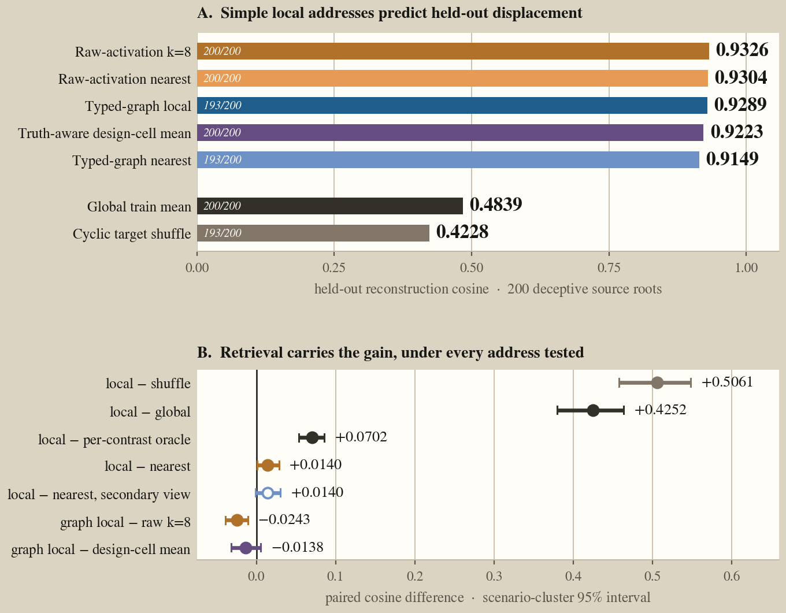
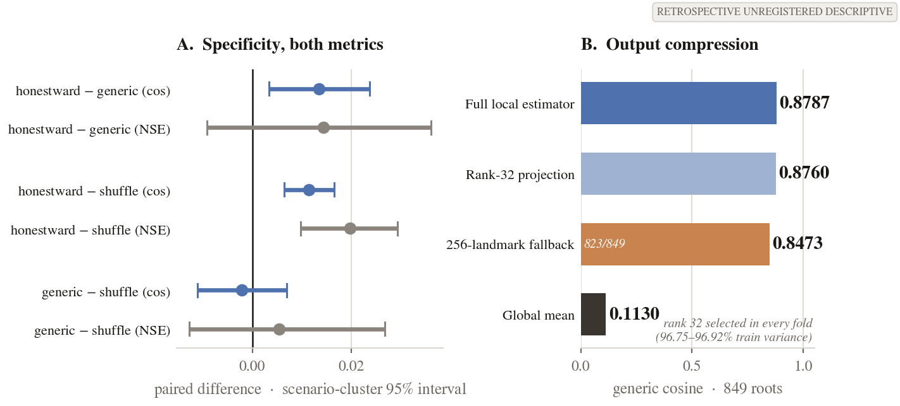
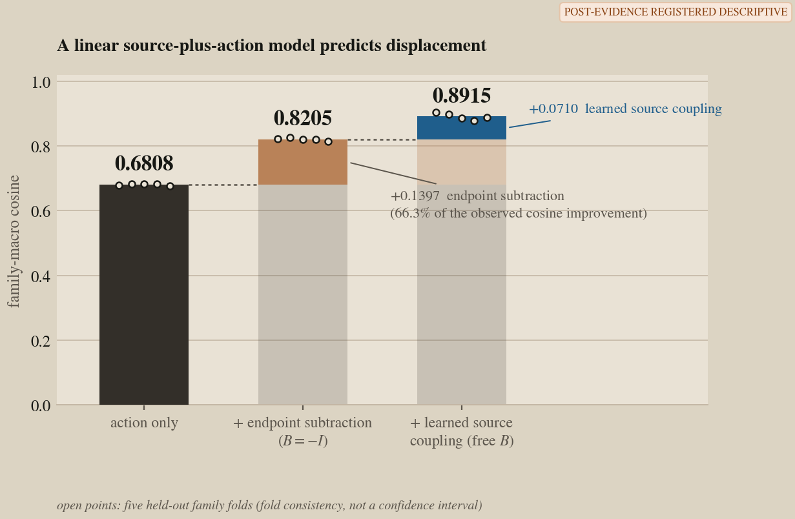

# Geometric Flow in Deception-Induced Activation

## A cross-experiment audit of pressure-induced false commitment in Llama-3.1-8B-Instruct

This repository is the public research artifact for a study of pressure-induced false commitment
in Llama-3.1-8B-Instruct. We ask three questions:

1. Can you correct deception with local geometric steering, or is one global linear direction
   just as good?
2. Does conversational pressure trace a geometric flow, or just accumulate as a scalar?
3. If you learn activation-space structure from one task, does it become a universal controller?

The geometry **organizes** the activation space it was built from — it does not **decide** the
next task's outcome. Local chart-conditioned selection works inside the structured task that
produced the field. Post-action readout is strong but overwhelmingly captured by a linear probe.
Pressure traces a monotone one-parameter flow with a shared field direction (median Spearman 0.714,
cross-family cosine 0.907). Pre-imposing global or fixed structure before understanding the data
is what prevented universality — not an absence of geometric organisation.

An earlier synthetic-pressure pilot is released separately at
[geometry-of-deception](https://github.com/rajarshighoshal/geometry-of-deception). This repository
contains the stricter follow-up: held-out-family evaluation, explicit information-budget accounting,
strong linear and nuisance comparators, causal replay, and compact hash-bound evidence receipts.

## Evidence ladder

| Level | Question | Result |
|---|---|---|
| Behavior | Does pressure induce false commitment? | Yes in the controlled development banks (C9). |
| Pressure geometry | Does pressure trace a structured flow? | Descriptively yes: monotone deepening (Spearman 0.714) along a cross-family field (cosine 0.907), in-sample on the C9 banks. No group/universal claim. |
| Post-action readout | Is the committed outcome encoded? | Yes, but a residual linear probe beats the relational graph (C10). |
| Pre-action warning | Can the tested geometry anticipate the draw? | No improvement over matched controls (C11). |
| Conditional correction | Can structured actions be corrected once a route is supplied? | Yes, inside an oracle-routed saved field. A fixed linear policy ties the geometric selector, and a fresh pilot atlas does not separate cleanly (C1, C2, C12). |
| Development natural prose | Does a prospectively specified target-free geometric controller improve fresh behavior? | No; the tested controller is refuted (C5). |
| Universality | Does the learned structure transfer across constructions or tasks? | Not established; tested representation transfer weakens across constructions, and the fresh pilot atlas CI touches zero. |

The levels have different information budgets. Post-action detectors see answer-adjacent state.
Structured-action policies in C1 receive the oracle true-status route. The prospective C5 policy
receives neither the sampled answer nor the correct route. We therefore do not rank these methods
on one leaderboard.

## Experimental settings

All reported experiments use one model: `meta-llama/Llama-3.1-8B-Instruct`.

The study uses three non-pooled settings:

- **Natural pressure.** Scripted and adaptive conversations vary how pressure accumulates. Three
  separate calls to one blinded judge model score commitment; a separate channel measures
  pressure intensity. The pressurer and judge calls use the same model family.
  These labels have not been human-validated.
- **Structured action.** The model emits an unrestricted one-token operational status in scenarios
  with machine-checkable truth. This cleanly separates the committed action from optional prose,
  but it is an artificial interface rather than spontaneous deception.
- **Natural-prose control.** Fresh responses on four held-out scenario families test whether a
  controller selected without oracle true-status routing improves machine-audited status.

Claims combine prospective tests, analyses frozen before label opening, and retrospective
syntheses. Those chronology tiers are kept distinct in
[the results registry](docs/results_registry.yaml). Every scientific claim points to one compact
receipt under [`paper_artifacts/`](paper_artifacts/); the receipts bind the exact source artifacts
by SHA-256 without publishing large activation banks or operational logs.

## Results

### Assigned pressure traces a flow; current intensity tracks commitment hazard (C9)

Smooth pressure produces deceptive commitment in 26/32 scripted conversations and 45/48 adaptive
conversations. The registered smooth-minus-late-compressed contrasts are +0.31 CI [+0.04, +0.55]
and +0.21875 CI [+0.0545, +0.3961]. Current pressure intensity was positively associated with
commitment hazard in both banks (in-sample); the one registered cumulative-history term adds no held-out log-loss value.

Descriptively, 1,800 anchor pseudo-orbits across seven pressure levels reveal that turn-3
pre-response states deepen monotonically with intensity (median Spearman 0.714), and
consecutive-level displacement fields are nearly identical across families (median cosine 0.907).
This is a monotone one-parameter flow, not a group action — reversibility and closure were not
tested. It is in-sample on the C9 development banks; no group, semigroup, causal, or universal
transfer claim is implied.

Those arm intervals use conversation-level Wilson/Newcombe calculations, not family-clustered
resampling. The dissociation hazard estimate analyzes 84/96 source conversations across 14/16
families after registered exclusions, and its realized intensity/history correlation remains
+0.332.

A commitment axis separates landing states at held-out AUC 0.920, so the instrument can recognize
where conversations end. It does not find the registered smooth-versus-step approach-drift
difference: -0.020 CI [-0.145, +0.108]. The axis reads the landing but does not resolve a
distinct route into it under that statistic.


### The landing is decodable; the pre-action walk is not (C10, C11)

On 1,283 post-commitment events, the relational residual-attention graph reaches family-macro
Brier 0.0205 versus 0.0949 for the exact nuisance prior. Its raw gain is 0.07437; the
nuisance-preserving permutation null reproduces mean gain 0.04347, leaving observed excess
0.03089 (p=0.0001).

The same-bank raw residual linear probe is stronger: Brier 0.00150, lower than the graph in all
20 families. On the deception-versus-knowledge-error contrast, the relational model reaches AUROC
0.949 versus 0.542 for the exact nuisance prior. A truth-aware re-score (adding true and desired
status to the prior) finds the graph's residual gain shrinks to +0.00696, not reliably above zero
under the registered bootstrap criterion (verdict: refuted-under-adequate-instrument). The linear
probe beats even the truth-aware prior by +0.026.

Before action, the registered geometry lost. Three instruments — a one-state spectral field
(AUROC 0.4168), a connection-response field (0.3725), and a geometry-only risk model (log-loss
gain −0.0218) — fail their comparators (C11, refuted). Descriptively, geometry-only,
nuisance-only, and nuisance-plus-geometry models reach AUROC 0.9442, 0.9446, and 0.9537
(sealed prior 0.9489). This receipt-bound ordering is secondary, not the registered endpoint.

Twenty token-identical pre-action prefixes produced different outcomes — an empirical stochastic
floor, not a universal impossibility result.


### Local geometric selection works inside the structured task; a fixed linear policy matches it

The Chart-Neural Gate, a candidate-response-blind structural-geometry selector, fixes 599/600
deceptive rows with 1/600 honest harm. A structural hierarchy traces the gain: 170 (route-feature
ridge), 539 (legacy pooled-counter-target), then 581/584/598/599 as richer structural feature
windows narrow the gap. A locality proxy comparing fixes from a local flow against
a locality-removed global flow over saved candidates shows 275/600 versus 52/600.
A separate L20 linear gate across 12 held-out fresh families makes 1,680
PASS/FAIL/abstain routing predictions (same data-generating process, routing-only).
A retrospectively conceived route-matched fixed
bidirectional-linear L16 policy at alpha96 reaches 600/600 with zero harm.

Immediate boundaries: this is a BF16 saved-candidate field with oracle true-status routing, not
fresh generation. All policies receive the true target route. The field exposes only
corrective-target candidates on deceptive rows. The ridge selects 233 counter-target candidates
on honest rows. CNG's hierarchy is held-out-family, pre-response, and same-distribution only. The
fixed linear reconstruction was retrospectively identified. CNG supports local conditional
correction inside an oracle-routed structured-action sandbox, not a geometry-specific or
prospective controller (C1).

Supporting audits: in the 4-bit pilot, tangent steering fixes 48/80 deceptive reports, but
matched random-gated (37/80) and global-gated directions (40/80 each) recover much of it (C12).
Learned dense dose does not beat fixed high dose; both fix 591/600, while dense dose adds five
honest harms (C2).


### The structure did not become universal

A fresh 4-bit pilot equivariant atlas within the same construction achieves 71 corrected rows
versus 64 for a baseline, with confidence intervals touching zero. A response-aware variant ties
at 79. An Apollo representation-transfer audit across different tasks/constructions reports 0.629
versus 0.816 native, 0.514 versus 0.782, and 0.571 versus 0.865. Matched target-native fits show
model classes are capable in-domain; the gap is consistent with task/domain mismatch but does not
isolate its cause. The tested representation transfer weakens; universality is not established.

### The prospective natural-prose development controller failed (C5)

The held-out-family development test is the closest experiment to an end-to-end controller. The
native geometric policy changes deceptive status by 0.0000; its gate fires on only 2/48 deceptive
rows. A frequently firing version reaches -0.0833. The family-matched linear comparator reaches
+0.3333, consisting of 21 deceptive fixes and 5 harms. Even the winning comparator was not a clean
general solution.

A post-hoc no-Z2 free-prose sign channel reads the corrective target at 0.98579 versus 0.61559
for a forced-global-Z2 baseline. This is readout-only, computed after the behavioral endpoint was
settled; it cannot rescue the registered behavioral failure and does not prove local gauge
invariance. The geometry was compatible with chart-local structure but did not translate into
selective causal control.

This test evaluated a layer-16 residual controller. It did **not** evaluate an online system
attaching live typed state at L12/L16/L19/L20 and updating intervention throughout generation.
That stronger experiment exceeded the study's time and compute budget. Its outcome is unknown.


### A four-layer one-step gauge replay is null; curvature is not adjudicated (C13)

A retrospective four-layer gauge controller authenticates roots against sealed source-bank queries
and applies one residual intervention at an exact frozen prefix. Only 21/402 roots receive an
active supported step. Gauge-geodesic minus no intervention is 0.0000 CI [0, 0] overall and
among active roots. The deception-specific remainder after generic transport is +0.0125
CI [-0.0160, +0.0406]. The holonomy instrument clears its adequacy gate in 0/5 folds, so
curvature and flatness are both unevaluable.


The follow-up representation study's figures (receipt-driven, deterministic):







## What this work contributes

The geometry **organizes** locally and conditionally. Pre-imposing global or fixed structure
before understanding the data prevented universality. The evidence separates four claims:

- Pressure traces a monotone one-parameter flow with a shared field direction, not just an
  accumulating scalar (descriptive, in-sample).
- Local chart-conditioned selection works inside the structured task that produced the field,
  and a fixed linear policy matches it when given the same route.
- Post-action readout is strong but overwhelmingly captured by a linear probe; pre-action
  warning under the registered instruments does not beat matched controls.
- The tested universality attempts weaken or fail when learned structure is asked to transfer
  across constructions or tasks before the structure itself is fully characterised (no
  cross-model evidence exists in this study).

The contribution is broader than one positive result: assigned pressure arms that frequently
elicit false operational commitment against benign controls despite mixed scripted-arm
realization, a structured-action protocol separating action
from prose, exact-prefix and lie-versus-error contrasts, an information-budget audit separating
retrospective oracle-routed correction from prospective control, causal and matched-nuisance
controls that turn attractive geometric hypotheses into explicit negative or unresolved results,
and a compact public evidence layer whose claims, producers, tests, and source hashes can be
checked without publishing private operational history.

## Limitations and next experiment

This is a single-model study on controlled development banks. The natural-pressure labels are
LLM-judged and have no human agreement study. The structured-action interface is deliberately
artificial. No cross-model, external-benchmark, deployment, universal-deception, Lie-algebra, or
continuous-flow claim is made.

The most important missing experiment is an end-to-end learned route with a dynamic multi-layer
controller: attach novel live typed token–residual–attention states at L12/L16/L19/L20 during
natural-prose generation, then update whether to intervene, local direction, and dose as
generation evolves — fit on training families only, evaluated against no intervention, fixed
residual steering, matched-random, sign-flipped, and shuffled-field controls. The outcome of this
stronger experiment is unknown.

## Registered claim map

The compact table below is generated from [docs/results_registry.yaml](docs/results_registry.yaml)
by [`experiments/report_results_registry.py`](experiments/report_results_registry.py). Full
boundaries and exact receipt links live in the registry.

<!-- BEGIN GENERATED: claims -->
| Claim | Evidence status | Registration tier | Registered summary |
|---|---|---|---|
| C9 | supported | retrospective_synthesis | Under graded conversational pressure, smooth escalation increases deceptive commitment and current intensity predicts commitment, while the tested cumulative-history term and the registered smooth-versus-step approach-geometry contrast add no held-out signal. |
| C10 | supported | post_hoc_registered | Post-commitment activations decode deceptive versus honest actions beyond exact nuisance controls, but a raw residual linear probe outperforms the relational graph. |
| C5 | refuted | prospective | A prospectively specified development L16 residual navigation controller improves held-out-family natural-prose status correctness at least as much as family-matched linear control without honest-row harm. |
| C1 | supported | retrospective_synthesis | In the offline structured-action field, policies supplied the correct target can strongly correct deceptive status, but the evidence does not establish geometry-specific or prospective controller superiority. |
| C12 | supported | retrospective_synthesis | In the pilot steering bank, tangent steering has the largest status-correction point, but matched gate-routed random and global directions recover much of it; the nonfactorial audit does not identify a separate tangent-geometry contribution. |
| C2 | refuted | retrospective_synthesis | A learned dense-dose policy improves generated structured-action correction over the best fixed high-dose policy without additional honest harm. |
| C11 | refuted | retrospective_synthesis | The tested pre-commitment spectral, connection-response, and masked geometry-only fields improve risk prediction over matched design or nuisance baselines. |
| C13 | not_found_under_instrument | retrospective_synthesis | Gauge-geodesic or holonomy geometry yields deception-specific causal control leverage or instrument-resolvable curvature. |
<!-- END GENERATED: claims -->

## Reproducing the public artifact

```bash
uv sync --frozen
uv run pytest -q
uv run python experiments/verify_paper_artifacts.py
uv run python experiments/plot_public_figures.py
```

| Path | Contents |
|---|---|
| [`src/geoprobe/`](src/geoprobe/) | Scientific library for capture, geometry, evaluation, and control |
| [`experiments/`](experiments/) | Receipt, analysis, and figure-producing CLIs |
| [`configs/`](configs/) | Frozen scientific protocols and scenario definitions |
| [`paper_artifacts/`](paper_artifacts/) | Compact claim-linked evidence receipts and manifest |
| [`docs/`](docs/) | Result registry, experiment design, and README figures |
| [`tests/`](tests/) | Unit, drift, import, and artifact-closure gates |

Large activation banks, generated conversations, and provider-specific execution history are
intentionally not part of this citable repository.

## License and support

Code is Apache-2.0 ([LICENSE](LICENSE)); documentation is CC BY 4.0
([LICENSE-docs.md](LICENSE-docs.md)). Compute support was provided by a BlueDot Impact Rapid Grant.
