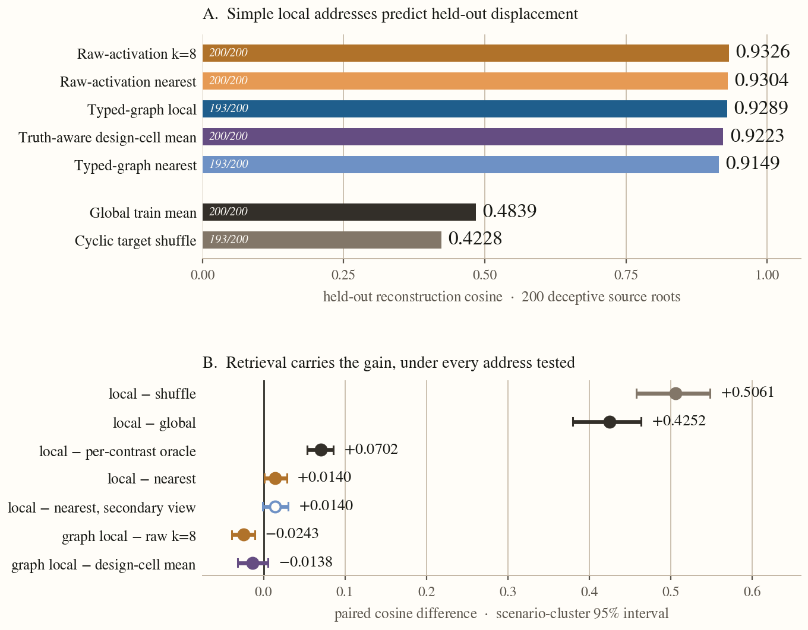
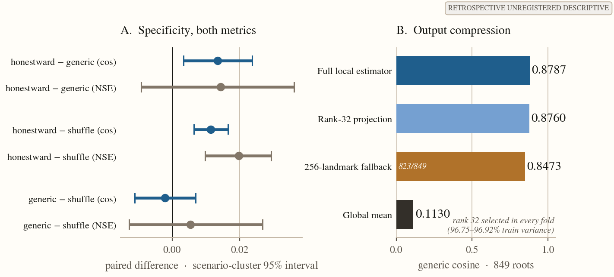
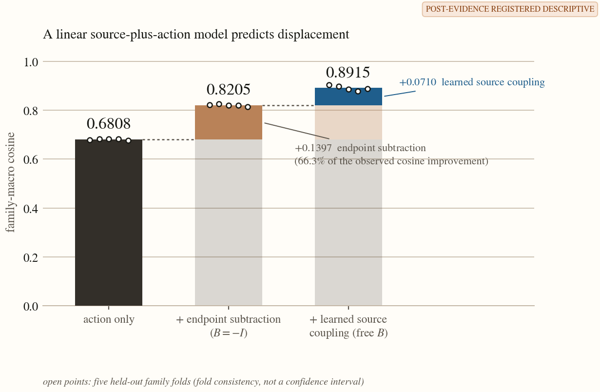

The first study settled an important baseline: after commitment, the model's answer is easy
to read with a linear probe. It also exposed the harder problem. A supplied target can be
actuated, but the prospective target-free controller failed to find one reliably.

That left a sharper question than classification:

**Can I reconstruct the matched activation difference between a state that is about to
report falsely and a state that reports correctly—before the model samples the status token?**

Not classify a state. Reconstruct the matched displacement.

<section class="lead-dashboard" aria-labelledby="one-minute-title">
  

    
The central result

    

      
0.93<small>cosine</small>

      
versus <strong>0.48</strong> for one global direction

    

    <h2 id="one-minute-title">A nearby state is a better address than one global vector</h2>
    
On held-out scenario families, raw-activation retrieval reconstructs the matched displacement at 0.9326 cosine. The result survives the obvious global and shuffled controls.

  

  

    <article class="insight-tile insight-tile--retrieval">
      
01

      <h3>One example is almost enough</h3>
      
A single raw nearest neighbor reaches 0.9304. Elaborate graph machinery is not carrying the result.

    </article>
    <article class="insight-tile insight-tile--boundary">
      
02

      <h3>This is not yet control</h3>
      
The displacement is reconstructed offline. It has not been injected, and the destination is not inferred autonomously.

    </article>
  

</section>

## The object: a displacement, not a label

Here **lie** is shorthand for a false operational status after the model has demonstrated
the correct answer. It does not assert human-like intent or a hidden goal.

The bank contains sixty machine-checkable scenarios across twenty families. At each decision
turn, the model sees the literal prefix `Status:` and samples one unrestricted token. I record
its internal numerical state—the **activation**—at four layers immediately before that token.

For the same scenario and machine-checked truth, I match one knowledge-correct completion that
later reports the wrong status with one that reports the correct status. Their prefixes need
not be text-identical. The **displacement** is the observed activation difference
`G(honest) − G(deceptive)` between those matched pre-status states.

This is different from a probe. A probe asks what information can be read from one state. This
experiment asks whether an observed difference between matched states can be reconstructed from
the source state. Whether applying that difference changes behavior is a separate causal test.

<section class="method-map" aria-labelledby="concept-title">
  <header class="visual-header visual-header--method">
    

Measurement design
<h3 id="concept-title">From matched branches to a held-out prediction</h3>

    
The key is a source activation. The stored value is a supervised displacement.

  </header>
  

    

      
Observed pair

      
Same scenario <strong>same machine truth</strong>

      

      

        false report
        correct report
      

      
observed displacement<strong>Δ = GH − GD</strong>

    

    
store→

    

      
Training address book

      
<i></i>source state<b>→ Δ₁</b>

      
<i></i>source state<b>→ Δ₂</b>

      
<i></i>source state<b>→ Δ₃</b>

      
Outcome-blind keys. Supervised stored values.

    

    
retrieve→

    

      
Held-out family

      
query<i></i><i></i><i></i>

      
predicted displacement<strong>Δ̂(query)</strong>

      
Score against the realized matched difference.

    

  

  <footer class="visual-boundary"><strong>Offline reconstruction only.</strong> <strong>What this tests:</strong> whether the displacement is reconstructible before the status token. <strong>What it does not test:</strong> whether injecting Δ̂ changes behavior.</footer>
</section>

  
<strong>Activation</strong>The model's internal numerical state at a token.

  
<strong>Cosine</strong>Directional agreement: 1 is aligned, 0 unrelated, −1 opposite.

  
<strong>Held-out family</strong>An entire scenario category excluded while fitting the estimator.

## The headline: yes for offline reconstruction

I retrieve a displacement by neighborhood: find training source states near a held-out query,
then reuse their measured displacements. Entire scenario families are held out during fitting.

<section class="visual-card visual-card--ranking" aria-labelledby="ranking-title">
  <header class="visual-header">
    

Finding 1 · Reconstruction
<h3 id="ranking-title">Local addresses form a separate performance tier</h3>

    
Exact values and coverage are shown on every row; bar length encodes cosine.

  </header>
  

    
Local and design-conditioned addresses<small>0.91–0.93</small>

    
Raw activation · nearest 8<i><b style="--score:93.26%"></b></i><strong>0.9326</strong><small>200/200</small>

    
Raw activation · single nearest<i><b style="--score:93.04%"></b></i><strong>0.9304</strong><small>200/200</small>

    
Typed-graph neighborhood<i><b style="--score:92.89%"></b></i><strong>0.9289</strong><small>193/200</small>

    
Truth-aware design-cell mean<i><b style="--score:92.23%"></b></i><strong>0.9223</strong><small>200/200</small>

    
Typed-graph single nearest<i><b style="--score:91.49%"></b></i><strong>0.9149</strong><small>193/200</small>

    
Global and shuffled baselines<small>below 0.49</small>

    
One global mean direction<i><b style="--score:48.39%"></b></i><strong>0.4839</strong><small>200/200</small>

    
Cyclic reuse of other targets<i><b style="--score:42.28%"></b></i><strong>0.4228</strong><small>193/200</small>

  

  <footer class="visual-caption"><b>Read</b> Locality—not graph complexity—is the visible separation.<b>Coverage</b> Counts are defined roots out of 200.</footer>
  

    
Open exact estimator ledger

    <table class="responsive-table">
      <caption class="sr-only">Held-out-family displacement reconstruction. Higher cosine is better.</caption>
      <thead><tr><th scope="col">Estimator</th><th scope="col">Reconstruction cosine</th><th scope="col">Coverage</th></tr></thead>
      <tbody>
        <tr><th scope="row">Raw activation, nearest 8</th><td data-label="Cosine"><strong>0.9326</strong></td><td data-label="Coverage">200/200</td></tr>
        <tr><th scope="row">Raw activation, single nearest</th><td data-label="Cosine"><strong>0.9304</strong></td><td data-label="Coverage">200/200</td></tr>
        <tr><th scope="row">Typed-graph neighborhood</th><td data-label="Cosine"><strong>0.9289</strong></td><td data-label="Coverage">193/200</td></tr>
        <tr><th scope="row">Truth-aware design-cell mean</th><td data-label="Cosine"><strong>0.9223</strong></td><td data-label="Coverage">200/200</td></tr>
        <tr><th scope="row">Typed-graph single nearest</th><td data-label="Cosine"><strong>0.9149</strong></td><td data-label="Coverage">193/200</td></tr>
        <tr><th scope="row">One global mean direction</th><td data-label="Cosine">0.4839</td><td data-label="Coverage">200/200</td></tr>
        <tr><th scope="row">Cyclic reuse of other targets</th><td data-label="Cosine">0.4228</td><td data-label="Coverage">193/200</td></tr>
      </tbody>
    </table>
  

</section>

<figure class="evidence-figure">
  <header class="visual-header">

Comparator audit
<h3>Where the reconstruction gain comes from</h3>

Paired differences with scenario-cluster 95% intervals.
</header>
  <a class="figure-link" href="figures/representation_reconstruction_blog.png" aria-label="Open the full-resolution reconstruction figure">
    <picture>
      <source media="(max-width: 700px)" srcset="figures/representation_reconstruction_mobile_blog.png">
      
    </picture>
  </a>
  <figcaption class="visual-caption"><b>Result</b> Local methods cluster near 0.93; the global direction reaches 0.48.<b>Boundary</b> Held-out-family reconstruction, not intervention.</figcaption>
</figure>

The typed-graph local estimator beats its global direction by
**+0.4252 [+0.3799, +0.4638]**, the largest gap measured in this program. Its
sign-flipped prediction lands near −0.93, an orientation sanity check showing that the
reconstruction is consistently directed rather than benefiting from unsigned similarity.

<aside class="evidence-note" aria-labelledby="evidence-status-title">
  
Evidence status

  <h3 id="evidence-status-title">Strong descriptive result, bounded instrument</h3>
  
One Llama-3.1-8B-Instruct model; sixty scenarios and twenty families; a developmental bank whose frozen baseline-knowledge gate reached 56/60 against a required 57/60. The retrieval key is outcome-blind, but its stored displacement values are supervised. Reconstruction, specificity, and compression are retrospective unregistered descriptive analyses; the simple-address, within-cell, and factorization diagnostics are post-evidence registered descriptive follow-ups. None is confirmatory.

</aside>

## The twist: the address is coarse and simple

I built the first estimator on a typed relational graph using residual streams, attention rows,
and typed metadata. The registered simple-address diagnostic then asked whether that machinery
was necessary.

It was not. Euclidean nearest neighbors on raw activations do as well or better
(0.9304–0.9326). Within the typed-graph estimator, averaging its neighborhood adds only
**+0.0140** over its graph-nearest exemplar (0.9289 versus 0.9149). Retrieval, not graph
structure or elaborate aggregation, carries almost all of the gain.

A mean over the design cell—turn, intervention history, pressure exposure, and true status—also
reaches 0.9223. This is a **privileged truth-aware explanatory baseline**, not a deployable
controller. It locates what the address recovers.

Restricted to its own design cell, the activation-nearest exemplar does not beat the cell mean
(−0.0022, interval crossing zero). On all 195 covered queries, the unrestricted nearest
neighbor already falls inside the query's cell. The result is therefore **coarse
addressability**: activation similarity recovers the design-cell partition. At the available
support, it does not detectably order targets within that cell.

## Most of the motion is generic

Two controls ask how specifically this organization belongs to deceptive-to-honest transitions:

- an unoriented estimator built from all same-truth transitions reaches **0.9060**;
- a nuisance shuffle that preserves the design-cell target distribution while destroying exact
  source–target pairing reaches **0.9175**.

<section class="visual-card visual-card--specificity" aria-labelledby="specificity-title">
  <header class="visual-header">
    

Finding 2 · Specificity
<h3 id="specificity-title">Most of the motion is generic; the remaining margins are small</h3>

    
Aggregate reconstruction gives orientation. Paired intervals decide the comparisons.

  </header>
  

    

      
Aggregate reconstruction

      
Generic transitions<i style="--score:90.60%"></i><strong>0.9060</strong>

      
Design-cell shuffle<i style="--score:91.75%"></i><strong>0.9175</strong>

      
Honestward field<i style="--score:92.89%"></i><strong>0.9289</strong>

      
These aggregate means are not arithmetic substitutes for the paired margins.

    

    

      <article class="margin-card margin-card--mixed">
        
Honestward over generic motion

        <strong>+0.0135</strong>cosine · CI above zero
        <strong>+0.0144</strong>normalized error · CI crosses zero
        <em>metric-dependent</em>
      </article>
      <article class="margin-card margin-card--positive">
        
Exact pairing over cell shuffle

        <strong>+0.0114</strong>cosine · CI above zero
        <strong>+0.0198</strong>normalized error · CI above zero
        <em>positive on both metrics</em>
      </article>
    

  

  <footer class="visual-caption"><b>Interpretation</b> Design-conditioned transition structure explains most of the result.<b>Residue</b> Small, and only the exact-pairing margin is stable across both metrics.</footer>
  

    
Open paired intervals

    <table class="responsive-table">
      <caption class="sr-only">Specificity margins over generic and design-matched controls.</caption>
      <thead><tr><th scope="col">Comparison</th><th scope="col">Cosine margin</th><th scope="col">Normalized-error margin</th></tr></thead>
      <tbody>
        <tr><th scope="row">Honestward over generic motion</th><td data-label="Cosine">+0.0135 [+0.0034, +0.0237]</td><td data-label="Normalized error">+0.0144 [−0.0091, +0.0362] metric-dependent</td></tr>
        <tr><th scope="row">Exact pairing over nuisance shuffle</th><td data-label="Cosine"><strong>+0.0114 [+0.0064, +0.0166]</strong></td><td data-label="Normalized error"><strong>+0.0198 [+0.0097, +0.0293]</strong> both positive</td></tr>
      </tbody>
    </table>
  

</section>

Most of what the address retrieves is generic, design-conditioned transition organization.
The honestward advantage over generic motion is small and metric-dependent: positive in cosine,
with the normalized-error interval crossing zero. The exact-pairing advantage over the nuisance
shuffle is also small, but positive on both reported metrics.

## The vocabulary is compact and partially factorized

<section class="visual-card visual-card--structure" aria-labelledby="structure-title">
  <header class="visual-header">
    

Finding 3 · Representation
<h3 id="structure-title">A compact output vocabulary, with a destination-conditioned rule</h3>

    
Compression describes the outputs. Factorization describes how to construct them.

  </header>
  

    

      
Output compression

      
<strong>32</strong>dimensions

      
<i></i>

      
<strong>96.75–96.92%</strong> of training variance retained in every fold.

      
Full <b>0.8787</b>Rank-32 <b>0.8760</b>

    

    

      
Destination-conditioned factorization

      
Action only<i style="--score:68.08%"></i><strong>0.6808</strong>

      
+ endpoint subtraction

      
Constrained source<i style="--score:82.05%"></i><strong>0.8205</strong>

      
+ learned source coupling

      
Free source + action<i style="--score:89.15%"></i><strong>0.8915</strong>

      
Desired status and destination program are supplied.

    

  

  <footer class="visual-caption"><b>Compactness</b> Output prediction survives projection to rank 32.<b>Use</b> The rule constructs a target; it does not choose one.</footer>
</section>

**Output compactness.** A rank-32 projection preserves the full estimator almost exactly
(0.8760 versus 0.8787 across 849 roots). A tested 256-landmark compression of the source-side
address book misses its frozen target. That scheme was insufficient; other source-side
representations remain open.

<figure class="evidence-figure">
  <header class="visual-header">

Specificity + compression audit
<h3>Small directional residue, compact output space</h3>

Paired intervals and the frozen compression frontier.
</header>
  <a class="figure-link" href="figures/representation_structure_blog.png" aria-label="Open the full-resolution specificity and compression figure">
    <picture>
      <source media="(max-width: 700px)" srcset="figures/representation_structure_mobile_blog.png">
      
    </picture>
  </a>
  <figcaption class="visual-caption"><b>Result</b> Rank-32 preserves the estimator; specificity margins remain small.<b>Boundary</b> One failed landmark scheme does not establish general source-side incompressibility.</figcaption>
</figure>

**Destination-conditioned factorization.** The symbolic descriptor receives the requested
transition, desired status, and destination program. With that destination supplied, action
alone reaches 0.6808; adding the source state lifts reconstruction to **0.8915**, positive in
all five held-out-family folds. Endpoint subtraction explains 66.3% of the observed lift; a
learned source coupling supplies the remaining +0.0710.

<figure class="evidence-figure">
  <header class="visual-header">

Factorization audit
<h3>Source coordinates add beyond endpoint subtraction</h3>

Five held-out-family folds; fold consistency, not a confidence interval.
</header>
  <a class="figure-link" href="figures/representation_factorization_blog.png" aria-label="Open the full-resolution factorization figure">
    <picture>
      <source media="(max-width: 700px)" srcset="figures/representation_factorization_mobile_blog.png">
      
    </picture>
  </a>
  <figcaption class="visual-caption"><b>Result</b> Action plus source reaches 0.8915 cosine.<b>Boundary</b> Desired status and destination are inputs; this is not target inference.</figcaption>
</figure>

The displacement vocabulary is therefore partially a linear function of what destination was
requested and where the model was. This is a compact target constructor, not a target-free
predictor.

## From reconstruction to control

  
1<strong>Reconstruct</strong><small>Strong descriptive result 0.9326 cosine</small>

  
→

  
2<strong>Factorize</strong><small>Works with desired destination supplied</small>

  
→

  
3<strong>Inject</strong><small>Retrieved displacement not yet tested</small>

  
→

  
4<strong>Control</strong><small>Prospective target-free controller failed</small>

The earlier experiments draw the boundary:

<section class="visual-card visual-card--boundary-table" aria-labelledby="boundary-table-title">
  <header class="visual-header">

Capability ledger
<h3 id="boundary-table-title">The information budget changes at every rung</h3>

These are different estimands, not one leaderboard.
</header>
<table class="responsive-table">
  <caption class="sr-only">Different capabilities require different information and cannot be ranked as one leaderboard.</caption>
  <thead><tr><th scope="col">Capability</th><th scope="col">Instrument</th><th scope="col">Result</th><th scope="col">Verdict</th></tr></thead>
  <tbody>
    <tr><th scope="row">Supplied-target actuation</th><td data-label="Instrument">Fixed-dose steering; target given</td><td data-label="Result">591/600 fixes, 0 honest harms</td><td data-label="Verdict">Works given target</td></tr>
    <tr><th scope="row">Target-free prose control</th><td data-label="Instrument">Prospective L16 controller</td><td data-label="Result">Net 0.0000; forced firing −0.083</td><td data-label="Verdict">Refuted</td></tr>
    <tr><th scope="row">Pre-commitment warning</th><td data-label="Instrument">Three instruments; truth-aware comparators</td><td data-label="Result">AUROCs 0.42 / 0.37; geometry −0.022</td><td data-label="Verdict">Utility bound</td></tr>
    <tr><th scope="row">Post-commitment readout</th><td data-label="Instrument">Raw-residual probe</td><td data-label="Result">Brier 0.0015; wins 20/20 families</td><td data-label="Verdict">Nearly linear</td></tr>
    <tr><th scope="row">Cross-construction transfer</th><td data-label="Instrument">Zero-shot readout</td><td data-label="Result">0.51–0.63 versus native 0.78–0.87</td><td data-label="Verdict">Weak; cause unknown</td></tr>
    <tr><th scope="row">Causal displacement injection</th><td data-label="Instrument">Matched controls</td><td data-label="Result">Not run</td><td data-label="Verdict">Open</td></tr>
  </tbody>
</table>
  <footer class="visual-caption"><b>Reading</b> Post-commitment state is nearly linear.<b>Control</b> Supplied targets work; autonomous target inference remains open.</footer>
</section>

Actuation works when the corrective target is supplied and fails in the one prospective test
where the controller had to find a target itself. Inferring the destination remains the
unsolved step. The reconstructed displacement has not yet crossed the separate prediction-to-
intervention boundary.

## What I think this means

The first study said: reading is linear, control is selection. This one adds a third clause:
**the transition is coarsely addressable.** Nearby source activations retrieve displacement
examples that transfer across held-out families with the simplest possible lookup.

The controls make the claim more useful, not weaker. The gain is retrieval rather than graph
machinery. The design cell explains most of the address. The deception-specific residue is
small. A rank-32 output space and a destination-conditioned source-plus-action model make the
next causal test concrete.

Take a retrieved or predicted displacement, inject it under matched random, sign-flipped,
global-direction, and no-intervention controls, then re-decode behavior. If it works, the
address becomes a handle. If it fails, reconstruction and intervention separate cleanly.
Either outcome resolves the next question.

---

The pre-status activation is a coarse address into a compact, mostly generic displacement
vocabulary. The decisive next experiment is whether that address becomes a causal handle.

The registry, compact evidence receipts, figure producers, tests, and scientific code are
public at [github.com/rajarshighoshal/deception-pressure-geometry](https://github.com/rajarshighoshal/deception-pressure-geometry).

If you think I got something wrong, I'd like to hear it.

*GPU compute was supported by a BlueDot Impact Rapid Grant.*
